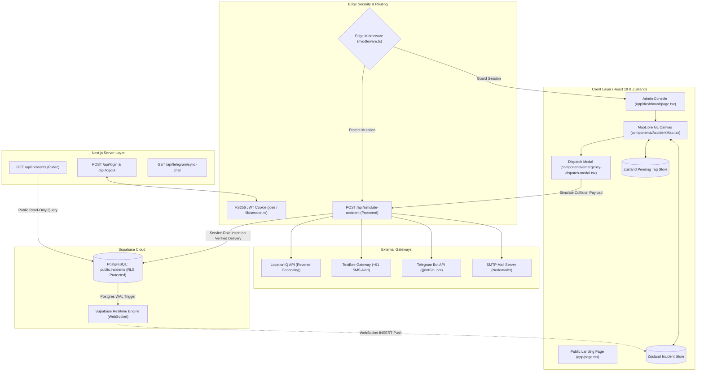
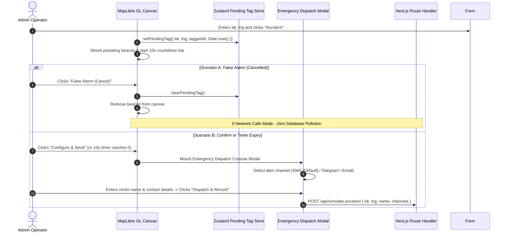
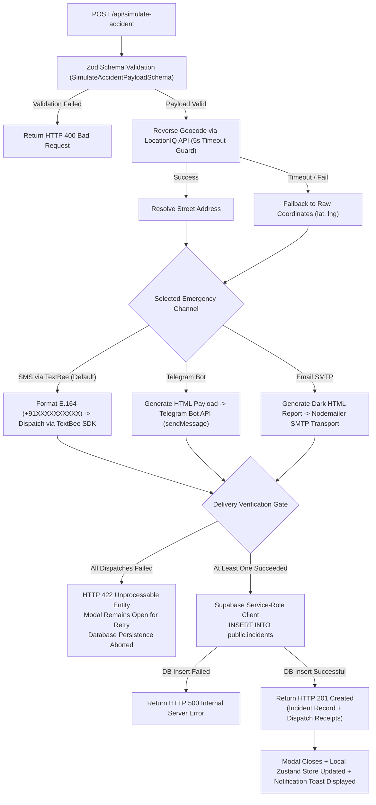
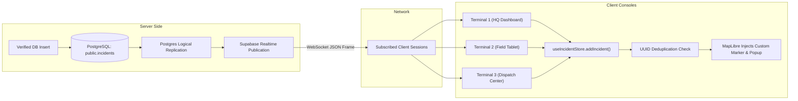

# Smart Helmet

**PS-06 | Low-Cost IoT Smart Helmet for Accident Detection & Rider Safety**  
*Category: Hardware &middot; Theme: Smart Vehicles*


---

## Background & Problem Statement

Two-wheeler fatalities are high in India, often worsened by delayed emergency response since no one is alerted immediately after a crash, especially on highways or remote roads.

**Smart Helmet** solves this by embedding a motion sensor (accelerometer/gyroscope) to detect crash-level impact, paired with a GPS+GSM/cellular module that automatically sends an emergency SMS alert with live location coordinates to a pre-set emergency contact when a crash is detected.

### Core Objectives & MVP Scope
- **Impact Detection Core Loop**: Microcontroller reads motion sensor telemetry and detects sudden crash-level spikes (g-force threshold).
- **Automated Emergency SMS Alert**: Transmits cellular SMS alerts with exact GPS coordinates and Google Maps navigation links.
- **Manual False-Alarm Cancellation**: A 10-second cancel button window allows riders or operators to dismiss false triggers immediately before alert dispatch and database persistence.
- **Real-Time Telemetry & Dispatch Console**: Next.js companion platform rendering live WebGL maps (MapLibre GL) synchronized in real-time across terminals via Supabase Realtime.

---

## Table of Contents

- [Key Features](#key-features)
- [System Architecture](#system-architecture)
- [Operational Workflows & System Diagrams](#operational-workflows--system-diagrams)
  - [1. Manual Coordinate Input & 10s False Alarm Guard](#1-manual-coordinate-input--10s-false-alarm-guard)
  - [2. Multi-Channel Emergency Dispatch & Atomic Verification Gate](#2-multi-channel-emergency-dispatch--atomic-verification-gate)
  - [3. Real-Time Multi-Terminal WebSocket Synchronization](#3-real-time-multi-terminal-websocket-synchronization)
- [Database Schema & Security Architecture](#database-schema--security-architecture)
- [Technology Stack](#technology-stack)

---

## Key Features

- **Interactive WebGL Vector Map (MapLibre GL)**: High-performance map canvas featuring 4 switchable tile providers (*OpenStreetMap Standard*, *CARTO Voyager*, *CARTO Positron*, and *CARTO Dark Tactical*), dynamic camera bounds fitting, and interactive incident popups.
- **Active Incident Management Drawer**: Integrated side-panel to view all live incidents in a clean list format. Admins can quickly locate accidents on the map or permanently delete false-positives (which synchronizes deletion across all active terminals via WebSocket).
- **Manual Coordinate Input & Sensor Simulation**: Instant accident simulation via manual latitude/longitude input with an interactive pulsing beacon and a 10-second visual countdown window.
- **Zero-Pollution False Alarm Guard**: Client-side cancellation mechanism that aborts accidental triggers in memory before any network request or database write occurs.
- **Multi-Channel Emergency Alert Dispatching**:
  - **SMS Gateway (TextBee API) [Default]**: Sends concise, high-priority SMS alerts with fixed `+91` (India) country codes, 10-digit mobile number validation, and direct Google Maps navigation links.
  - **Telegram Bot API**: Delivers formatted HTML collision notices with coordinates, street address, timestamp, and victim identifiers to configured field channels.
  - **Emergency Email (SMTP / Nodemailer)**: Generates high-contrast, dark-mode incident reports with one-click responder routing.
- **Strict Verification Persistence Protocol**: Incidents are persisted into PostgreSQL **only after** verified successful alert delivery. If all alert channels fail, the database write is rejected with an inline retry prompt.
- **Sub-50ms Real-Time Push (Supabase Realtime)**: Real-time PostgreSQL change-feed replication pushing new collisions across all active operator terminals without polling.
- **Edge Route Protection & Ephemeral Sessions**: Cookie-based signed HS256 JWT sessions protected by Next.js Edge Middleware with zero stored database passwords.
- **Fast Reverse Geocoding with Telemetry**: LocationIQ reverse geocoding with a 5-second `AbortController` timeout guard, sub-50ms resolution, and graceful raw coordinate fallback.

---

## System Architecture

Smart Helmet operates as a unified Next.js App Router monolith combining React 19 client components, Edge route middleware, server-side Route Handlers, and Supabase PostgreSQL.



---

## Operational Workflows & System Diagrams

### 1. Manual Coordinate Input & 10s False Alarm Guard

When an operator enters latitude and longitude in the form overlay, a provisional accident tag is placed in memory. The system starts a 10-second countdown allowing the operator to dismiss accidental triggers with zero network overhead.



---

### 2. Multi-Channel Emergency Dispatch & Atomic Verification Gate

The backend processes the dispatch request, performs reverse geocoding, attempts alert delivery through the requested channel, and gates database persistence on confirmed delivery.



---

### 3. Real-Time Multi-Terminal WebSocket Synchronization

Once an incident is inserted into PostgreSQL, Supabase Realtime broadcasts the row across all connected operator sessions instantly.



---

## Database Schema & Security Architecture

### PostgreSQL Table Definition (`public.incidents`)

```sql
CREATE EXTENSION IF NOT EXISTS "uuid-ossp";

CREATE TABLE IF NOT EXISTS public.incidents (
  id UUID PRIMARY KEY DEFAULT uuid_generate_v4(),
  lat DOUBLE PRECISION NOT NULL,
  lng DOUBLE PRECISION NOT NULL,
  address TEXT,
  victim_name TEXT,
  telegram TEXT,
  email TEXT,
  sms TEXT,
  occurred_at TIMESTAMPTZ NOT NULL,
  status TEXT NOT NULL DEFAULT 'confirmed' CHECK (status = 'confirmed'),
  created_at TIMESTAMPTZ NOT NULL DEFAULT now()
);

-- Index for descending timestamp queries (newest collisions first)
CREATE INDEX IF NOT EXISTS idx_incidents_occurred_at_desc 
ON public.incidents (occurred_at DESC);
```

### Security & Row Level Security (RLS) Policies

| Role / Context | Permissions | Implementation Mechanism |
|---|---|---|
| **Public (`anon`)** | `SELECT` Only | Protected by Supabase RLS policy `USING (true)` |
| **Authenticated Users** | `SELECT` Only | Read-only access to historical collisions |
| **Admin Route Handlers** | `INSERT` / `MUTATION` | Executed exclusively server-side via `SUPABASE_SERVICE_ROLE_KEY` (bypasses RLS) |
| **Admin Operator Session** | Full Access | Signed HS256 JWT cookie (`admin_session`), verified at Next.js Edge |

---

## Technology Stack

| Layer | Technology | Purpose |
|---|---|---|
| **Framework** | Next.js 16 (App Router) | React Server Components, Route Handlers, Edge Middleware |
| **UI Library** | React 19 & TypeScript | Strict type safety, functional component architecture |
| **Styling** | Tailwind CSS v4 | Engineering-grade monochrome dark mode per `DESIGN.md` |
| **Map Rendering** | MapLibre GL JS | WebGL vector map rendering with 4 interchangeable tile sets |
| **Database** | Supabase (PostgreSQL) | Structured persistence, descending timestamp indexing |
| **Realtime Sync** | Supabase Realtime | WebSocket changefeed for live multi-session synchronization |
| **SMS Gateway** | TextBee API / `@textbee/sdk` | Cellular SMS collision notifications with `+91` formatting |
| **Telegram Bot** | Telegram Bot API | Formatted emergency collision dispatches with Google Maps link |
| **Email Gateway** | Nodemailer / SMTP | Responsive HTML emergency collision reports |
| **Geocoding** | LocationIQ API | Latency-monitored reverse geocoding with timeout guard |
| **State Management**| Zustand | Dedicated stores for confirmed incidents and pending tags |
| **Schema Validation**| Zod | Runtime payload validation for auth, dispatches, and phone numbers |
| **Session Security**| `jose` (JWT) | HS256 tamper-proof signed session cookies |
